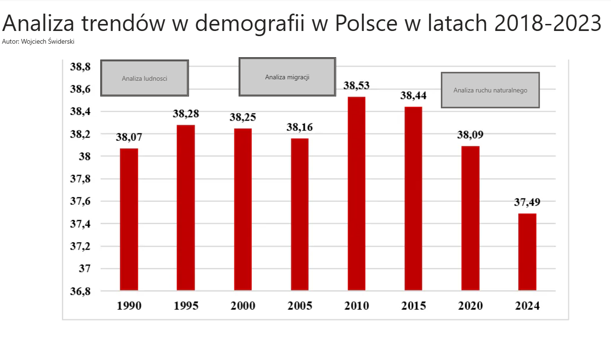
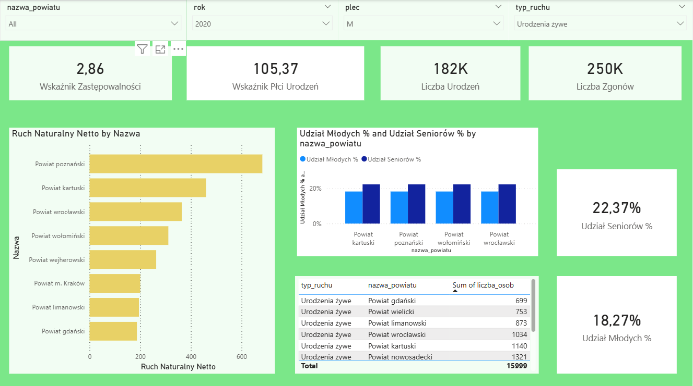
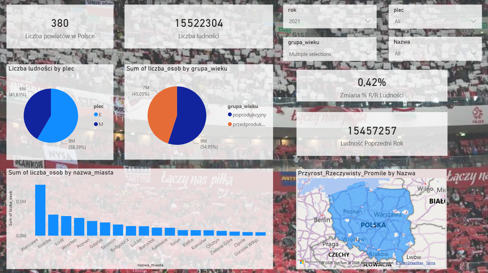

# Population_analysis_pl
Author: WojtaS52

## Poland Population Report

## 📊 Overview
This project contains a comprehensive analysis of population demographics in Poland. It utilizes **Python**, **SQL** for data processing and **Power BI** for interactive visualization. The dashboard provides insights into demographic trends, including population density, age distribution, and year-over-year changes.

## 📂 Data Source
The data used in this analysis comes from Statistics Poland (Główny Urząd Statystyczny).
* Source: https://stat.gov.pl/
* Scope: Population, internal/external migration, and vital statistics for powiats.

## 🖼️ Dashboard Preview

### Main Dashboard - navigation
An overview of the key metrics and navigation.

### 2020 Analysis
Detailed breakdown of demographic data for the year 2020.

### 2021 Analysis
Detailed breakdown of demographic data for the year 2021.

## 🚀 Features
* **Data Processing:** Python scripts to clean and prepare demographic data.
* **Interactive Maps:** Geographic visualization of population distribution.
* **Time Series Analysis:** Comparison of data between specific years.
* **Dynamic Filtering:** Filter data by region, age group, or specific demographic indicators.

## 🛠️ Technology Stack
* **Microsoft Power BI:** Data modeling and visualization (`.pbix`).
* **Python (Jupyter Notebook):** Data analysis and preparation using `pandas`.
* **SQL** Simple data analysis, written in sql.

## 📂 File Structure
* `raport_ludnosc_pl.pbix`: The main Power BI report file.
* `jupyter_helper/sample.ipynb`: Jupyter Notebook containing the data analysis code ("Kondycja demograficzna powiatów w Polsce").

## 🔧 How to Run
1.  **Data** Download data from GUS website
2.  **Notebook:** Open `sample.ipynb` in Jupyter Lab or VS Code to view the data processing steps.
3.  **Report:** Open `raport_ludnosc_pl.pbix` in Microsoft Power BI Desktop to interact with the dashboard.
